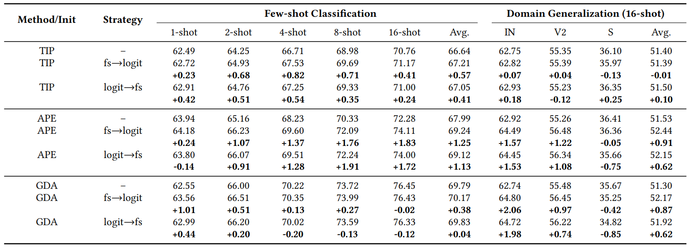

# EvoVLMA: Evolutionary Vision-Language Model Adaptation

## Introduction
Pre-trained Vision-Language Models (VLMs) have been exploited in various Computer Vision tasks (e.g., few-shot recognition) via model adaptation, such as prompt tuning and adapters. However, existing adaptation methods are designed by human experts, requiring significant time cost and experience. Inspired by recent advances in Large Language Models (LLMs) based code generation, we propose an Evolutionary Vision-Language Model Adaptation (EvoVLMA) method to automatically search training-free efficient adaptation algorithms for VLMs. We recognize feature selection and logits computation as the key functions in training-free VLM adaptation, and propose a two-stage LLM-assisted evolutionary algorithm for optimizing these parts in a sequential manner, effectively address the challenge posed by the expansive search space through a divide-and-conquer strategy. Besides, to enhance the stability and efficiency of searching process, we propose low-precision code conversion, web based code execution and process monitoring, leading to a highly effective automatic algorithm design system. Extensive experiments demonstrate that the algorithms found by EvoVLMA can obtain promising results compared to previous manually-designed ones. More specifically, in the 8-shot image classification setting, the classical APE algorithm can be improved by 1.91 points in recognition accuracy. This research opens new possibilities for automating the optimization of adaptation algorithms of pre-trained multimodal models.

<p align="center">
    
    
    The flowchart of EvoVLMA. Top-left panel: the workflow of automatic algorithm designing; right panel: the implementation of crossover and mutation; bottom left panel: evaluating the performance of searched algorithms on downstream tasks. The population consists of several individuals or algorithms, which could be regarded as the message passed between two consecutive steps. The algorithm is composed of two components: thoughts, code.
</p>

## Installation

Follow the following instructions for installation:
```shell
conda create -n evovlma python=3.9.0
conda activate evovlma
git clone https://github.com/kding1225/EvoVLMA
cd EvoVLMA
pip install -e .
```

## How to Run

### Step1: Dataset Preparation

Follow [Tip-Adapter](https://github.com/gaopengcuhk/Tip-Adapter) to install 11 downstream datasets. Similar to the process of preparing these data, the process for preparing the five holdout datasets is represented as follows.

#### (1) CIFAR100

* Create a folder named cifar100/ under $DATA
* Download CIFAR100 from [https://www.cs.toronto.edu/~kriz/cifar.html](https://www.cs.toronto.edu/~kriz/cifar.html)
* Extract the data and organize it into the following structure:

```shell
./cifar100
└── cifar100png
    ├── test
    │   ├── apple
    │   ├── aquarium_fish
    │   ...
    └── train
        ├── apple
        ├── aquarium_fish
        ...
```

#### (2) FashionMinist

* Create a folder named fashionmnist/ under $DATA
* Download FashionMinist from [https://www.kaggle.com/datasets/zalando-research/fashionmnist](https://www.kaggle.com/datasets/zalando-research/fashionmnist)
* Extract the original 4 files using [extract_fashionmnist.py](fsl/datasets/extract_fashionmnist.py). The directory structure should look like
```shell
./fashionmnist
├── test
│   └── fashion_mnist
│       ├── Ankle boot
│       ├── Bag
│       ...
└── train
    └── fashion_mnist
        ├── Ankle boot
        ├── Bag
        ...
```

#### (3) ObjectNet

* Create a folder named objectnet-1.0 under $DATA
* Download ObjectNet from [https://objectnet.dev/download.html](https://objectnet.dev/download.html)
* Extract the data and organize it into the following structure:

```shell
./objectnet-1.0
├── images
│   ├── air_freshener
│   └── briefcase
│   ...
└── mappings
    ├── folder_to_objectnet_label.json
    ├── imagenet_to_label_2012_v2
    ├── objectnet_to_imagenet_1k.json
    └── pytorch_to_imagenet_2012_id.json
```

#### (4) UcMerced

* Create a folder named UCMerced_LandUse under $DATA
* Download UcMerced from [http://weegee.vision.ucmerced.edu/datasets/landuse.html](http://weegee.vision.ucmerced.edu/datasets/landuse.html)
* Extract the data and organize it into the following structure:

```shell
./UCMerced_LandUse
├── class_names.txt
└── images
    ├── agricultural
    ├── airplane
    ...
```

#### (5) UCSDBirds

* Create a folder named UCSDBirds under $DATA
* Download UcMerced from [https://www.vision.caltech.edu/datasets/cub_200_2011/](https://www.vision.caltech.edu/datasets/cub_200_2011/)
* Extract the data and organize it into the following structure:

```shell
./UCSDBirds
├── attributes.txt
└── CUB_200_2011
    ├── attributes
    │   ├── certainties.txt
    │   ├── class_attribute_labels_continuous.txt
    │   └── image_attribute_labels.txt
    ├── bounding_boxes.txt
    ├── classes.txt
    ├── image_class_labels.txt
    ├── images
    │   ├── 001.Black_footed_Albatross
    │   ├── 002.Laysan_Albatross
    │   ...
    ├── images.txt
    ├── parts
    │   ├── part_click_locs.txt
    │   ├── part_locs.txt
    │   └── parts.txt
    ├── README
    └── train_test_split.txt
```

### Step2: Feature Extraction

Follow the following instructions to extract features of holdout datasets:

```shell
cd fsl
python extract_feats.py --config configs/RN50/search/cifar100.yaml
python extract_feats.py --config configs/RN50/search/fashionmnist.yaml
python extract_feats.py --config configs/RN50/search/objectnet.yaml
python extract_feats.py --config configs/RN50/search/ucmerced.yaml
python extract_feats.py --config configs/RN50/search/birds.yaml
```

You can change `RN50` to use a different model, such as ViT-B16.

### Step3: Start Model Server and Monitor

First, start model server (gpuids=0,1, 4 processes per gpu, first port=6000):
```shell
bash server.sh start 0,1 4 6000
```

Second, start process monitor:
```bash
nohup python monitor.py > monitor.log 2>&1 &
```

Besides, if you want to stop model server, use
```shell
bash server.sh stop
```

### Step4: Run Searching Program

First, setup your Deepseek API key:
```shell
export APIKEY=sk-xxxxxxxxxxxxxxxxxxxxxxxxxxxxxxxx
```
The API key can be obtained from [https://api-docs.deepseek.com/](https://api-docs.deepseek.com/).

Second, use the following instructions to run the code searching process:
```shell
# for fs->logit strategy 
python run_ael_fs+logit.py <initial_algorithm> <clip_backbone> <dataset> <inst_per_shots> <sample_class> <ntest_per_class>

# for joint strategy
python run_ael_joint.py <initial_algorithm> <clip_backbone> <dataset> <inst_per_shots> <sample_class> <ntest_per_class>

# search logit function only
python run_ael_logit.py <initial_algorithm> <clip_backbone> <dataset> <inst_per_shots> <sample_class> <ntest_per_class>

# for logit->fs strategy
python run_ael_logit+fs.py <initial_algorithm> <clip_backbone> <dataset> <inst_per_shots> <sample_class> <ntest_per_class>
```

The meaning of the parameters:
* initial_algorithm: initial algorithm (tip, ape, gda)
* clip_backbone: vision encoder backbone (RN50, RN101, ViT-B16, ViT-B32)
* inst_per_shots: number of sampled training set for each shot setting (1, 2, 3, ...)
* sample_class: should a subset be sampled from all classes (1/0)
* ntest_per_class: number of sampled test samples for each class (e.g., 10)

An example using fs->logit searching strategy, Tip-Adapter based initialization, all of five holdout datasets, ResNet-50 backbone, 1 instance per shot, no class sampling, 10 test samples per class:
```shell
python run_ael_fs+logit.py tip RN50 5d 1 0 10
```

**Remark: Some of our searched codes can be found under [RN50_evol](fsl/RN50_evol) folder, you can evaluate their performance directly using the following instructions.**

## Evaluation
The performance evaluation is performed on 11 downstream datasets. The instructions are:

```shell
# evaluate the original algorithms
# sh run_fsl.sh <method> <clip_backbone> <ntrials> <dtype> <seed> <gpuid>
sh run_fsl.sh tip RN50 500 float 1 0 # Tip-Adapter algorithm
sh run_fsl.sh ape RN50 500 float 1 0 # APE algorithm
sh run_fsl.sh gda RN50 500 float 1 0 # GDA algorithm

# evaluate fs->logit strategy with Tip-Adapter based initialization
# sh run_fsl_ael_fs+logit.sh tip <clip_backbone> <dataset> <inst_per_shots> <sample_class> <ntrials> <dtype> <seed> <gpuid>
sh run_fsl_ael_fs+logit.sh tip RN50 5d 1 0 500 float 1 0

# evaluate logit->fs strategy with Tip-Adapter based initialization
# sh run_fsl_ael_logit+fs.sh tip <clip_backbone> <dataset> <inst_per_shots> <sample_class> <ntrials> <dtype> <seed> <gpuid>
sh run_fsl_ael_logit+fs.sh tip RN50 5d 1 0 500 float 1 0

# evaluate joint strategy with Tip-Adapter based initialization
# sh run_fsl_ael_joint.sh tip <clip_backbone> <dataset> <inst_per_shots> <sample_class> <ntrials> <dtype> <seed> <gpuid>
sh run_fsl_ael_joint.sh tip RN50 5d 1 0 500 float 1 0

# evaluate logit strategy with Tip-Adapter based initialization
# sh run_fsl_ael_logit.sh tip <clip_backbone> <dataset> <inst_per_shots> <sample_class> <ntrials> <dtype> <seed> <gpuid>
sh run_fsl_ael_logit.sh tip RN50 5d 1 0 500 float 1 0
```

Use the following instruction to parse the results:
```shell
python parse_results.py fsl_5d_inst1_nt10_tip_fs+logit_ael_popsize10_npop10_sc0_shots1_seed1 TIP <shots>
```

* shots=1,2,4,8,16: compute accuracy for a certain shot
* shots=all: compute average accuracy of all shots

## Experiments

### Main Results

<p align="center">
    
</p>

The results of manually-designed algorithms and automatically-designed algorithms under the fewshot setting are listed in this table. The bolded numbers highlight the improvements over manual algorithms, which imply that the automatically-designed algorithms outperform manual ones in most cases. The improvement can be as large as 1.91%. Although [GDA](https://github.com/mrflogs/ICLR24) has already achieved SOTA results, the automatically-designed algorithms can still achieve better results. It has been recognized that GDA cannot achieve good results under low-shot settings due to the inaccurate covariance estimation. The automaticallydesigned algorithms improve this notably.

### Examples of Generated Code

(1) Tip-Adapter based initialization, logit->fs

* logit computation code:
```python
import torch
import torch.nn.functional as F

def compute_logits(train_feats, train_labels, test_feats, clip_weights, indices, alpha0, alpha1, alpha2):
    """
    thoughts: The new algorithm computes classification logits by combining zeroshot classification logits, a
feature-channel importanceweighted similarity-based cache logits, a class-specific feature aggregation term with feature-channel
importance weighting, and a train-feature-guided logits where the feature-channel importance is used to refine both the test features and
the train features before computing the similarity matrix, and the train-featureguided logits are further weighted by the similarity between test features and train features.
    """
    c, k, d = train_feats.shape
    train_feats = train_feats.view(-1, d)
    train_labels = F.one_hot(train_labels.view(-1)).type(train_feats.dtype)
    
    # Adjust test and train features using important feature channels
    test_feats_adjusted = test_feats.clone()
    train_feats_adjusted = train_feats.clone()
    test_feats_adjusted[:, indices] *= alpha2
    train_feats_adjusted[:, indices] *= alpha2
    
    # Zero-shot logits with adjusted test features
    clip_logits = 100 * test_feats_adjusted @ clip_weights.t()
    
    # Compute similarity matrix using adjusted train features
    similarity_matrix = torch.exp(-alpha1 * (1 - test_feats_adjusted @ train_feats_adjusted.t()))
    
    # Cache model logits with weighted similarity matrix
    cache_logits = similarity_matrix @ train_labels
    
    # Class-specific feature aggregation term with feature channel importance weighting
    class_aggregated_feats = train_feats.view(c, k, d).mean(dim=1)
    class_aggregated_feats[:, indices] *= alpha2
    class_similarity = test_feats @ class_aggregated_feats.t()
    
    # Train-feature-guided logits weighted by similarity
    train_guided_logits = (test_feats @ train_feats.t()) * (test_feats_adjusted @ train_feats_adjusted.t()) @ train_labels
    
    # Combine logits
    logits = clip_logits + alpha0 * cache_logits + alpha1 * class_similarity + train_guided_logits
    
    return logits
```

* feature selection code:
```python
import torch

def feat_selection(clip_weights, train_feats, w0, w1, topk):
    """
    thoughts: The new algorithm selects feature channels by maximizing the discriminative power of the features, which is achieved by minimizing the intra-class cosine similarity of the concatenated visual and textual features while maximizing the inter-class cosine similarity of the textual features.
    """
    feats = torch.cat([clip_weights.unsqueeze(1), train_feats], dim=1)
    cate_num, samp_num, feat_dim = feats.shape

    # Compute intra-class cosine similarity
    intra_sim = torch.zeros(feat_dim).cuda()
    for i in range(cate_num):
        class_feats = feats[i]
        mean_feats = class_feats.mean(dim=0, keepdim=True)
        intra_sim += torch.sum(class_feats * mean_feats, dim=0) / samp_num
    intra_sim /= cate_num
    
    # Compute inter-class cosine similarity of textual features
    mean_clip_weights = clip_weights.mean(dim=0, keepdim=True)
    inter_sim = torch.sum(clip_weights * mean_clip_weights, dim=0) / cate_num
    
    # Combine criteria
    criterion = w0 * inter_sim - w1 * intra_sim
    _, indices = torch.topk(criterion, k=topk)
    return indices
```

(2) Tip-Adapter based initialization, fs->logit

* feature selection code:
```python
import torch
def feat_selection(clip_weights, train_feats, w0, w1, topk):
    """
    thoughts: The new algorithm selects feature channels by maximizing the classspecific feature importance weighted by the inter-class divergence, while minimizing the intra-class variance and the correlation between selected channels, weighted by hyperparameters.
    """
    cate_num, samp_num, feat_dim = train_feats.shape
    
    # Compute class-specific feature importance
    class_importance = torch.einsum('cd,cnd->d', clip_weights, train_feats) / (cate_num * samp_num)
    
    # Compute inter-class divergence
    class_means = train_feats.mean(dim=1) # Shape: (cate_num, feat_dim)
    inter_div = torch.var(class_means, dim=0) # Shape: (feat_dim,)
    
    # Compute intra-class variance
    intra_var = torch.var(train_feats, dim=(0, 1)) # Shape: (feat_dim,)
    
    # Compute correlation between feature channels
    correlation = torch.einsum('cnd,cnd->d', train_feats, train_feats) / (cate_num * samp_num)
    
    # Combine criteria
    criterion = w0 * (class_importance * inter_div) - w1 * (intra_var + correlation)
    
    # Select topk features
    _, indices = torch.topk(criterion, k=topk)
    
    return indices
```

* logit computation code:
```python
import torch
import torch.nn.functional as F

def compute_logits(train_feats, train_labels, test_feats, clip_weights, indices, alpha0, alpha1, alpha2):
    """
    thoughts: The new algorithm computes classification logits by combining zeroshot classifier logits, a feature channel importancebased logits with adaptive reweighting, a class prototype-based logits with dynamic scaling, and a weighted similarity-based cache model logits with adaptive kernel, while introducing a novel feature channel importance-based regularization term and a class-specific weighting scheme based on train labels.
    """
    c, k, d = train_feats.shape
    train_feats = train_feats.view(-1, d)
    train_labels = F.one_hot(train_labels.view(-1)).type(train_feats.dtype)
    
    # Zero-shot classifier logits
    clip_logits = 100 * test_feats @ clip_weights.t()
    
    # Feature channel importance-based logits with adaptive reweighting
    important_feats = test_feats[:, indices]
    important_weights = clip_weights[:, indices]
    channel_importance = torch.norm(important_weights, dim=1, keepdim=True)
    adaptive_weight = torch.mean(test_feats @ train_feats.t(), dim=1).unsqueeze(1)
    channel_logits = 100 * (important_feats @ important_weights.t()) * (channel_importance.t() * adaptive_weight)
    
    # Class prototype-based logits with dynamic scaling
    class_prototypes = train_feats.view(c, k, d).mean(dim=1)
    prototype_scaling = 1 / (1 + alpha2 * torch.norm(class_prototypes, dim=1, keepdim=True))
    prototype_logits = 100 * (test_feats @ class_prototypes.t()) * prototype_scaling.t()
    
    # Cache model logits with adaptive kernel
    similarity_matrix = torch.exp(-alpha1 * (1 - test_feats @ train_feats.t()))
    cache_logits = similarity_matrix @ train_labels
    
    # Feature channel importance-based regularization term
    regularization_term = torch.norm(test_feats[:, indices], p=2, dim=1).unsqueeze(1) *
    torch.norm(clip_weights[:, indices], p=2, dim=1)
    
    # Class-specific weighting based on train labels
    class_weights = train_labels.sum(dim=0).unsqueeze(0)
    class_weighted_logits = cache_logits * class_weights
    
    # Combine all logits
    logits = clip_logits + alpha0 * class_weighted_logits + alpha1 * channel_logits +
    alpha2 * prototype_logits + regularization_term
    
    return logits
```

For more results, please refer to our paper.

## Citation

```bibtex
@article{evovlma,
    title={EvoVLMA: Evolutionary Vision-Language Model Adaptation},
    author={Kun Ding, Ying Wang, Shiming Xiang},
    journal = {ACM Multimedia},
    year={2025}
}
```

## Acknowledgements
This project is built upon the following open-source works:
- Tip-Adapter: [https://github.com/gaopengcuhk/Tip-Adapter](https://github.com/gaopengcuhk/Tip-Adapter)
- APE: [https://github.com/yangyangyang127/APE](https://github.com/yangyangyang127/APE)
- GDA: [https://github.com/mrflogs/ICLR24](https://github.com/mrflogs/ICLR24)
- CoOp: [https://github.com/KaiyangZhou/CoOp](https://github.com/KaiyangZhou/CoOp)
